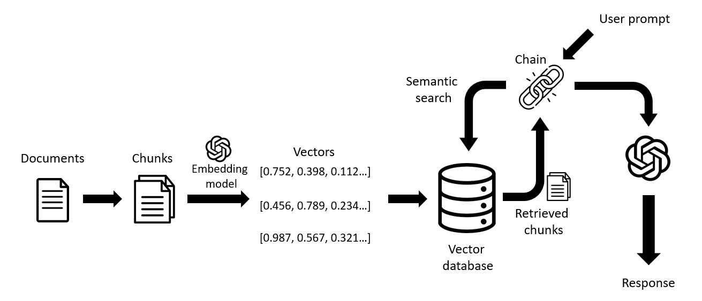

# Financial Question Answering(QA) with LangChain and OpenAI 
 
 

This project implements QA using OpenAI's embedding models and LangChain's Python library.  The aim is to make a user-friendly Financial QA application with the ability to ingest data from multiple sources (word, pdf, txt, json)

Dataset Used

- We used the dataset from this link
  https://github.com/czyssrs/finqa

Process -
- Upload the json files downloaded from the datasources. Because of open ai token constraint we read only 100 rows for now.
- Ask Question in the UI

Domain areas include:
- Document splitting
- Embeddings (OpenAI)
- Vector database (Chroma / FAISS)
- Semantic search types
- Retrieval chain

## Upcoming works:
- Capability to create embeddings for any amount of data 
- In memory vector database to cloud-native vector database
- Introduce conversation retriever and memory states
- Fine tuning model on FinQA dataset

